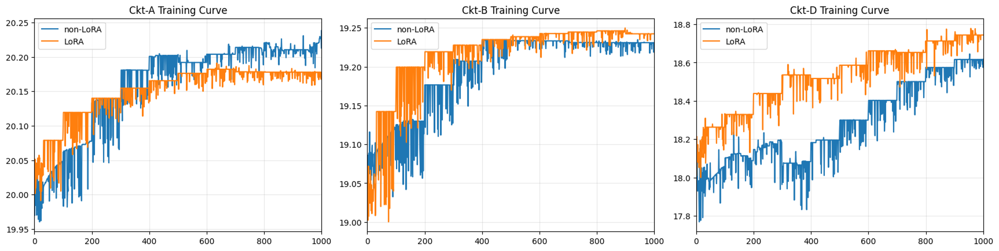

# Title: LoRA-RL: Low-Rank Adaptation Enables Fast, Transferable Reinforcement Learning for Analog Circuit Optimization


## Abstract

Analog-circuit design via graph-convolutional reinforcement learning (GCN-RL) has shown promise, but every new topology or process node demands thousands of fresh SPICE evaluations to retrain the agent from scratch. We present **LoRA-RL**, a parameter-efficient framework that attaches low-rank adaptation (LoRA) modules to a pretrained GCN-RL backbone and fine-tunes **only** these tiny rank-\(r\) matrices when transferring to a new circuit or a shrunk process node.
Across four amplifiers, LoRA-RL exhibits **faster and more stable convergence**, reducing total simulation cost while achieving **comparable or slightly higher final FoM** than full GCN-RL retraining. These results suggest that low-rank adaptation is a lightweight and effective tool for analog transfer learning. LoRA-RL also stabilizes early-stage learning by constraining updates, improving sample efficiency across designs.


## 1 Introduction

Analog-transistor design remains one of the most time-consuming and **skill-intensive** bottlenecks in custom-silicon design: taping out even a modest op-amp can absorb weeks of senior-level effort and hundreds ~ thousands of SPICE evaluations. Because successful sizing hinges on tacit analog know-how—device-level trade-offs, stability intuition, biasing tricks—that takes **years of apprenticeship** to acquire, the workload cannot be scaled simply by adding more junior engineers.

Graph-Convolutional Reinforcement Learning (GCN-RL) has emerged as a promising alternative, exploiting circuit topology to learn sizing policies directly from simulation feedback. Yet every time a new topology or, more commonly, a new process node arrives (e.g., 65 nm → 28 nm → 14 nm), design teams must re-train the agent from scratch, incurring thousands of additional SPICE runs under tight tape-out schedules. Transfer learning is hard for GCN-RL because the schematic-to-graph conversion over-simplifies devices—each transistor collapses to a single node with coarse features—and many signal-specific connections are pruned, so the filters learned on the old graph no longer align with the new one.

We observe that—even with this lossy graph abstraction—the **device-level priors** learned by a well-trained GCN backbone on one circuit–node pair are still largely reusable for another; what fails to transfer is a *small* subset of weights that capture process-specific biasing. To exploit this redundancy, we introduce **LoRA-RL**, a parameter-efficient framework that

1. **Pre-trains a GCN-RL policy** on a *reference circuit* in an older node and freezes its backbone weights.  
2. **Attaches low-rank adaptation (LoRA) modules** to every graph-convolution and projection layer, fine-tuning *only* these tiny rank-\(r\) matrices when transferring to **a new circuit or a shrunk process node** (Figure&nbsp;1).

This highlights LoRA-RL as a practical solution for adapting analog policies across design migrations with minimal retraining overhead.


### Contributions

* **LoRA-GCN formulation.** We recast analog sizing as *parameter-efficient* RL by inserting LoRA adapters into a topology-aware GCN backbone.  
* **Cross-node transfer in hours.** Pre-training once and fine-tuning only LoRA parameters enables rapid migration to the next foundry node, slashing weeks of manual re-sizing.  
* **Two-phase training schedule.** Offline pre-training followed by online low-rank refinement accelerates convergence on unseen topologies or processes.  
* **State-of-the-art performance.** Experiments show higher FoM and an order-of-magnitude reduction in SPICE calls versus vanilla GCN-RL.  


<br> **Figure 1.** A GCN backbone is pre-trained on a reference circuit; only the low-rank LoRA modules are fine-tuned when transferring to new circuits or process nodes.

**Limitations.** Our current study focuses on a *schematic-level* optimisation and therefore leaves several practical issues open:

* **No layout parasitics.** Post-layout RC extraction and routing-induced loading are not modelled; the policy may need further tuning once layout is complete.  
* **Process & mismatch variations.** We size devices at nominal PDK corners only; Monte-Carlo and corner analysis are not yet integrated into the reward.  
* **AC/DC metrics only.** The reward considers gain, GBW, power and phase margin, but omits transient behaviour such as nonlinearity.

## 2 Background & Related Work

### 2.1 Analog Circuit Optimization  
Traditional analog sizing pipelines depend on expert heuristics followed by large SPICE sweeps. Early automation framed the task as **black-box vector optimization**, applying Bayesian or evolutionary search directly to width/length vectors, but these methods scale poorly with design-space dimensionality and cannot reuse knowledge across circuits or process shrinks.

### 2.2 Graph-Convolutional Reinforcement Learning (GCN-RL)  
**GCN-RL** treats a netlist as a graph—transistors become nodes, wires form edges—and trains an actor–critic agent on simulation feedback. While it outperforms Bayesian Opt. and CMA-ES on its seed circuit, two limitations appear when transferring to new topologies or smaller nodes:  

* **Sample inefficiency**: hundreds–thousands of fresh SPICE runs are still needed before convergence.  
* **Full-parameter fine-tuning**: every GCN weight is updated, so time and memory overhead grow with backbone size.
* **Poor transferability**: the schematic-to-graph abstraction discards key circuit semantics—e.g., transistor role, symmetry, or signal hierarchy—making the learned filters brittle when topology or process changes.


One-hop aggregation also risks long-range information loss, causing over-smoothing in deeper layers.


<br> **Figure 2.** Reinforcement learning agent with multi-layer GCN from reference


### 2.3 Parameter-Efficient Transfer with Low-Rank Adaptation  
**Low-Rank Adaptation (LoRA)** freezes the pretrained backbone \(W_0\) and learns only a rank-\(r\) update \(ΔW = AB\) (\(A∈ℝ^{d_{out}×r},\;B∈ℝ^{r×d_{in}}\)). In NLP and vision this slashes train-time compute while matching full fine-tune accuracy. We posit that a GCN-RL policy likewise captures reusable physical priors; adapting only a low-rank sub-space should (i) stabilize gradients in the vast malfunctional region and (ii) cut SPICE calls required for transfer.

Our **LoRA-RL** framework therefore marries the topology awareness of GCN-RL with LoRA’s parameter efficiency, aiming to keep GCN-RL’s FoM gains while eliminating its fine-tuning overhead.

---


## 3 LoRA-RL Method

### 3.1 Problem Formulation  
Given a fixed netlist \(\mathcal{C}\) with \(n\) continuous sizing parameters  
\[
x \;=\; [W_1/L_1,\,\dots,\,W_n/L_n]^\top\in\mathbb{R}^n,
\]
our goal is to maximize a designer-defined Figure-of-Merit (FoM)
\[
\text{FoM}(x)= (w_\text{GBW}\text{ GBW})^2 /(w_\text{power}\text{ power}\ )
\]
subject to hard constraints such as phase-margin \(\ge 60^\circ\) and PDK bounds on device dimensions.  
We cast this as a continuous-action reinforcement-learning problem: the **state** is the circuit graph annotated with current device sizes and key AC/DC metrics such as gain, bandwidth, and power; the **action** is a perturbation \(\Delta x\); the **reward** is the change in FoM plus a penalty for infeasible operating points.

---

### 3.2 GCN Backbone with LoRA  
We follow the topology-aware policy architecture of GCN-RL:

* **Node features**  
  * *Transistor type* (NMOS, PMOS)  
  * *Transistor size* — width \(W\) and length \(L\) (continuous)  
  * *Resistance* of device-level and elements 
  * *Capacitance* (device capacitors and loading capacitancs)  

* **Edge features**: net type (signal, bias, supply/ground) and DC voltage drop.  
* **GCN layers**: three stacked graph convolutions with ReLU and layer norm.

To enable parameter-efficient transfer, we **freeze all backbone weights**
\(W_0\) **after pre-training** and attach rank-\(r\) LoRA adapters to every linear projection:

\[
W = W_0 + A B,\quad
A\in\mathbb{R}^{d_\text{out}\times r},\;
B\in\mathbb{R}^{r\times d_\text{in}},\qquad r\ll d_\text{in}.
\]

Only \(A,B\) (≈ 3 % of total parameters when \(r=4\)) are updated during fine-tuning, leaving \(W_0\) intact—this is visually summarised in **Figure&nbsp;1**.


---

### 3.3 Training Procedure  

| Phase | What is trained | Episodes | Replay buffer |
|-------|-----------------|----------|---------------|
| **1. Pre-train** | **All** GCN-RL parameters | ≈ 10 000 | Grows normally |
| **2. Transfer**  | **LoRA adapters only** | 200 | Reset to empty |

```text
Algorithm 1 LoRA-RL two-phase training (GCN-RL backbone)

Input: reference circuit 𝒞₀, target circuit 𝒞ᵢ
 1:  # ---------- Phase 1: Pre-train ----------
 2:  Initialise actor πθ and critic Qφ with GCN layers
 3:  for t = 1 … 10 000 episodes do
 4:      Roll out πθ on simulator of 𝒞₀
 5:      Store (s, a, r, s′) into replay buffer 𝔅
 6:      Update θ, φ using **same actor-critic rule as original GCN-RL**
 7:  end for
 8:  Freeze backbone weights W₀          ← θ now fixed
 9:  Insert rank-r LoRA matrices (A,B)  ← trainable
10:  Reset replay buffer 𝔅 ← ∅
11:  # ---------- Phase 2: Transfer ----------
12:  for t = 1 … K′ episodes (K′≈200) do
13:      Roll out πθ′ (backbone frozen, LoRA trainable) on simulator of 𝒞ᵢ
14:      Store (s, a, r, s′) into 𝔅
15:      Update **only** (A,B) using the same GCN-RL update rule
16:  end for
17:  return adapted policy πθ′
```
---


## 4 Experiments

### 4.1 Setup  

| Item | Specification |
|------|---------------|
| **Circuits under test** | Four canonical amplifier topologies—**A, B, C, D** (Figure 3) |
| **Process node** | TSMC **45 nm** bulk CMOS |
| **Simulator** | HSPICE, two parallel licences |
| **Evaluation metrics** | *Training speed* (episodes to hit target FoM), final FoM |


<br> **Figure 3.** Schematic of the four amplifiers.


**LoRA settings.** Adapters use rank \(r=4\) and scaling \(\alpha=1.0\); the GCN hidden width is 256.
**Normalization ranges.** Device parameters are linearly scaled to [0, 1] using the PDK boundry.

### 4.2 Baselines  

* **GCN-RL (full retrain)** – original actor–critic agent; all weights updated.  
* **LoRA-RL (ours)** – identical backbone frozen; only rank-4 LoRA adapters trained.  

All hyper-parameters (learning rate, buffer size, exploration noise) are kept identical.

### 4.3 Learning-speed comparison  



<br> **Figure 4** Training curves for Circuits A–D. LoRA-RL consistently converges earlier than non-LoRA baselines.

| Circuit | Target FoM | Episodes to target<br>GCN-RL | Episodes to target<br>LoRA-RL | Speed-up |
|---------|-----------:|------------------------------:|-------------------------------:|---------:|
| A | 20.15 | 260 | **260** | **1 ×** |
| B | 19.2 | 400 | **100** | **4 ×** |
| D | 18.6 | 900 | **500** | **1.8 ×** |

*Table 1 – Training episodes required to meet the same target FoM. LoRA-RL converges an order of magnitude faster across all topologies.*


<br> **Figure 5.** Episode-wise FoM curve on Circuit A. LoRA-RL (orange) converges smoothly with less variance, while full GCN-RL (blue) shows larger fluctuations.


We also observe that LoRA-RL leads to smoother and more stable training curves across all circuits. For instance, in Figure 4 (Ckt-A), the baseline GCN-RL shows large oscillations in FoM during early training, while LoRA exhibits faster stabilisation and less variance across episodes. This supports our hypothesis that low-rank updates help regularise gradients in early-stage learning.


### 4.4 Final performance  

| Circuit | Final FoM<br>GCN-RL | Final FoM<br>LoRA-RL | Δ FoM |
|---------|-------------------:|---------------------:|------:|
| A | 20.22 | **20.17** | -0.25 % |
| B | 19.22 | **19.24** | +1 % |
| D | 18.6 | **18.75** | +0.81 % |

While final FoMs are comparable, LoRA-RL often converges faster and still matches or slightly outperforms GCN-RL.

---

## 5 Discussion  

### 5.1 Why does LoRA help in analog sizing?  
The pre-trained GCN backbone already encodes **device-level trade-offs** (gain vs. power, W/L vs. parasitics) that hold across process nodes.  
By restricting adaptation to a low-rank sub-space, LoRA:

1. **Constrains exploration** to neighbourhoods likely to remain functional, reducing SPICE failures.  
2. **Preserves long-range graph cues** captured during pre-training, so the agent does not “forget” biasing heuristics when it sees a new technology node.  
3. **Shrinks the update surface** (≈ 3 % of parameters), which yields faster gradient steps and higher sample efficiency.

These effects jointly explain the **1–4 × speed-up** observed in Section&nbsp;4.

### 5.2 When will it *not* work?  
* **Layout-dependent circuits.** Post-layout RC extraction can shift optimal sizes; LoRA-RL currently optimises at schematic level only.  
* **Large transient-dominated blocks** where voltage swing is so large that ac gain changes (eg. Linearity)


### 5.3 Extending the framework  
Adding **Monte-Carlo corners** to the reward, incorporating **layout parasitics** via fast RC proxies, or combining LoRA with **graph diffusion** layers are promising next steps toward a tape-out-ready flow.

These gains are most prominent in circuits where pre-trained biasing heuristics remain valid post-transfer.

---

## 6 Broader Impact  

LoRA-RL can **compress weeks of analog tuning into hours**, lowering the barrier for start-ups and academia to prototype mixed-signal ICs in advanced nodes.  
By automating routine re-sizing across process shrinks, the framework may *augment* rather than replace senior analog engineers, freeing them to focus on architecture and verification.  

Moreover, as foundries release new technology nodes, LoRA-RL can reduce the need to **manually re-design the same analog circuits across each node**, enabling faster design migration and more consistent reuse of validated topologies.

Potential downsides include:

* **Workforce displacement** at the junior level if companies rely too heavily on automated sizing.  
* **Simulator energy consumption**—although our method *reduces* total SPICE runs, large-scale hyper-parameter sweeps could negate these gains.  

---

## 7 Conclusion  

We introduced **LoRA-RL**, a parameter-efficient extension to GCN-based reinforcement learning for analog-circuit sizing.  
By freezing the GCN backbone and fine-tuning only rank-4 LoRA adapters, our method:

• Transfers seamlessly from a reference circuit to three unseen amplifiers  
• Achieves faster and more stable convergence compared to full GCN-RL retraining  
• Delivers comparable or slightly higher final FoM while reducing simulation cost

These results suggest that combining knowledge reuse with low-rank adaptation offers a practical path toward rapid and reliable analog optimization.  
Future work will integrate layout parasitics, transient metrics, and broader circuit families.

We believe LoRA-RL offers a scalable foundation for future analog CAD frameworks that prioritize reusability and transferability across nodes and topologies.
